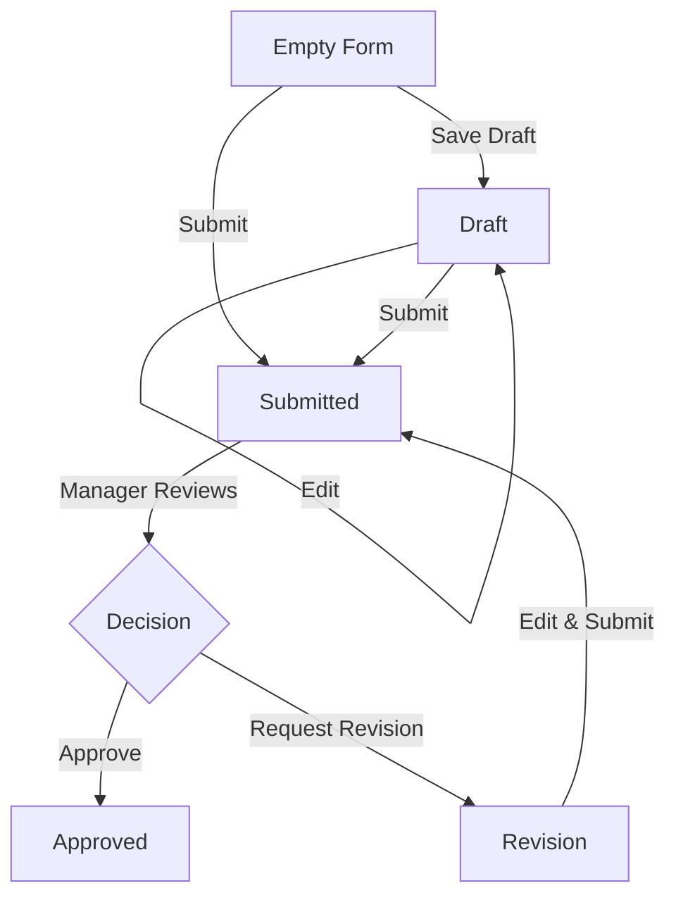

# Employee Work Journal UX & Logic

## 1. UX Flow Overview

The Employee Work Journal is designed to be a daily habit—quick, secure, and clear. The system ensures that employees always know the status of their work reports.

### Daily Routine
1.  **Login** → Dashboard / Journal Page.
2.  **Check Today's Status**:
    *   *No Entry*: See "What did you do today?" form.
    *   *Draft*: See "Continue Draft" or form pre-filled.
    *   *Sent*: See Read-Only view of the submitted journal.
    *   *Revision*: See specific Manager Feedback + Editable Form.

---

## 2. Journal Status State Machine

We use 4 standardized statuses. **"In Progress" is REMOVED** to avoid ambiguity.

| Status | Label UI | Meaning | Actions Allowed |
| :--- | :--- | :--- | :--- |
| **Draft** | `📝 Draft` | Saved locally/cloud, not visible to manager. | Edit, Delete, **Submit** |
| **Submitted** | `📤 Menunggu` | Sent to Manager. Locked for employee. | **View Only** (Read-Only) |
| **Revision** | `✏️ Revisi` | Manager requested changes. Notes visible. | **Edit**, Submit Revision |
| **Approved** | `✅ Disetujui` | Finalized. Permanent record. | **View Only** |

### State Transitions

---

## 3. Bug-Proof Checklist (Implemented)

### ✅ Data Integrity
- [x] **Conflict Detection**: Prevents creating 2 journals for the same date.
- [x] **Auto-Save**: Drafts are saved automatically after 10s of typing.
- [x] **Optimistic UI**: List updates immediately upon save, no "disappearing" rows.

### ✅ User Guidance
- [x] **Real-time Validation**: "Min 10 characters" warning shown instantly.
- [x] **Read-Only Mode**: "Submitted" journals explicitly show a lock icon and cannot be edited.
- [x] **Manager Feedback**: Revision notes appear at the very top in an orange alert box.

---

## 4. Technical Implementation Guidelines

### Component Structure
*   **`JurnalSaya.tsx`**: Main Controller. Handles data fetching and `isReadOnly` logic.
*   **`JournalForm.tsx`**: Dumb Component. Handles form inputs, validation, and Read-Only rendering. 
*   **`JournalFormModal.tsx`**: Responsive Wrapper (Dialog on Desktop, Drawer on Mobile).

### Database Schema (Supabase)
Use `work_journals` table:
*   `verification_status`: `draft`, `submitted`, `need_revision`, `approved`
*   `work_result`: `completed`, `progress`, `pending` (Result of the *tasks*, not the journal status)

### Recommended Copywriting
*   **Empty State**: "Belum ada jurnal hari ini. Ceritakan aktivitasmu."
*   **Success Draft**: "Draft tersimpan. Jangan lupa kirim sebelum pulang."
*   **Success Submit**: "Jurnal terkirim! Manager akan segera mereview."
*   **Revision Alert**: "Perlu Revisi: [Manager Note]"

---

## 5. Visual Standards (Colors)

| Status | Color | Tailwind Class |
| :--- | :--- | :--- |
| Draft | Slate (Gray) | `bg-slate-100 text-slate-600` |
| Submitted | Amber (Yellow) | `bg-amber-100 text-amber-600` |
| Revision | Orange | `bg-orange-100 text-orange-600` |
| Approved | Emerald (Green) | `bg-emerald-100 text-emerald-600` |

*Note: Use soft backgrounds with strong text for maximum readability.*
